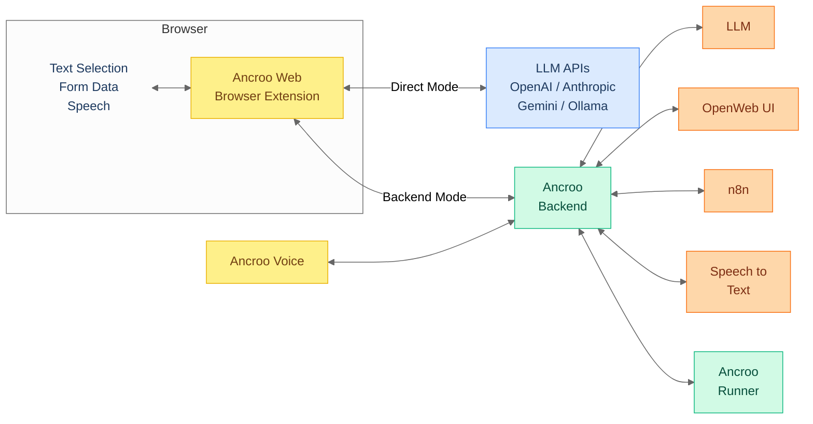

#  Ancroo

[](LICENSE)
[](https://www.gnu.org/software/bash/)
[]()

**Your AI workflows, your infrastructure, your data.** Ancroo is a self-hosted productivity ecosystem — select text in the browser, trigger an AI workflow, get results right where you work. Grammar correction, speech-to-text, form automation, and more — all powered by local LLMs and STT models. Nothing leaves your network.

> **Phase 0 (Beta)** — Core functionality works end-to-end, but the stack runs without encryption or authentication. Intended for local/trusted networks only. See the [Roadmap](ROADMAP.md) for the security path forward.


## Why Ancroo?

- **Works where you work** — select text in any browser tab, trigger AI workflows, get results inline — no app-switching, no copy-paste
- **Any software, any website** — not tied to one editor or platform; if it runs in a browser, Ancroo can help
- **Fully self-hosted** — your data stays on your machine, no cloud dependency
- **All-in-one** — LLMs, speech-to-text, automation, wiki, dashboard — everything runs out of the box
- **GPU-flexible** — works with NVIDIA (CUDA), AMD (ROCm), or CPU-only
- **One installer** — 3 commands to a running stack with AI chat, workflow engine, and STT

## How It Works



**Example (Backend Mode):** You select a paragraph with typos in your browser → press a hotkey → the extension sends the text to your server → Ollama fixes the grammar with a local LLM → the corrected text replaces your selection. Under 3 seconds, fully offline.

**Example (Direct Mode):** Install the extension, add your OpenAI/Anthropic/Gemini API key → select text → press a hotkey → the extension calls the LLM API directly → result appears in the page. No server needed.

## Quick Install

```bash
git clone https://github.com/ancroo/ancroo-stack.git
cd ancroo-stack
bash install.sh
```

The installer walks you through GPU and STT selection, optionally clones companion projects (backend, runner, extension), and prints a summary with all service URLs and credentials when done. See the [Stack README](https://github.com/ancroo/ancroo-stack#quick-start) for details.

## Components

| Project                                                                    | What it does                                                                                          |
| -------------------------------------------------------------------------- | ----------------------------------------------------------------------------------------------------- |
| [**Ancroo Stack**](https://github.com/ancroo/ancroo-stack)     | Docker infrastructure — Ollama, Open WebUI, PostgreSQL, n8n, BookStack, STT, and more |
| [**Ancroo Web**](https://github.com/ancroo/ancroo-web)         | Browser extension — select text, trigger workflows, get AI results inline. Works standalone (Direct Mode) or with the backend                             |
| [**Ancroo Backend**](https://github.com/ancroo/ancroo-backend) | Workflow engine — connects extension to LLMs, STT, and n8n                                            |
| [**Ancroo Runner**](https://github.com/ancroo/ancroo-runner)   | Script runner — deterministic transformations via user-extensible plugins                              |
| [**Ancroo Voice**](https://github.com/ancroo/ancroo-voice)     | Desktop push-to-talk STT — hold a key, speak, text appears at cursor                                  |

Each component works independently, but together they form a complete self-hosted AI workspace. Ancroo Web can also run standalone in Direct Mode — just add your LLM provider API key, no server required.

## What's Included

After installation, your server runs:

| Service        | Port  | Purpose                    |
| -------------- | ----- | -------------------------- |
| Open WebUI     | 8080  | AI chat interface with RAG |
| Ollama         | 11434 | Local LLM engine           |
| Ancroo Backend | 8900  | Workflow execution API     |
| Ancroo Runner  | 8510  | Deterministic script runner |
| n8n            | 5678  | Workflow automation        |
| BookStack      | 8875  | Documentation wiki         |
| Speaches/Whisper | 8100/8002 | Speech-to-text       |
| Homepage       | 80    | Service dashboard          |
| Adminer        | 8081  | Database admin UI          |

## Contributing

Contributions are welcome! Feel free to open an [issue](https://github.com/ancroo/ancroo/issues) or submit a pull request.

## Security & Roadmap

See the [Roadmap](ROADMAP.md) for the phased security path (encryption → API protection → SSO/multi-user).

See [SECURITY.md](SECURITY.md) for the vulnerability reporting policy. To report a vulnerability, please use [GitHub's private vulnerability reporting](https://github.com/ancroo/ancroo/security/advisories/new) instead of opening a public issue.

## Author

**Stefan Schmidbauer** — [GitHub](https://github.com/Stefan-Schmidbauer) · [stefan@ancroo.com](mailto:stefan@ancroo.com)

## Acknowledgments

Ancroo builds on these open-source projects:

| Project | Purpose | License |
|---------|---------|---------|
| [Ollama](https://ollama.com/) | Local LLM inference | MIT |
| [Open WebUI](https://docs.openwebui.com/) | AI chat interface with RAG | [Open WebUI License](https://docs.openwebui.com/license/) |
| [OpenAI Whisper](https://github.com/openai/whisper) | Speech recognition models | MIT |
| [Speaches](https://github.com/speaches-ai/speaches) | Whisper API server (CUDA) | MIT |
| [n8n](https://n8n.io/) | Workflow automation | [Sustainable Use License](https://github.com/n8n-io/n8n/blob/master/LICENSE.md) |
| [PostgreSQL](https://www.postgresql.org/) | Database | PostgreSQL License |
| [Homepage](https://gethomepage.dev/) | Service dashboard | GPL-3.0 |

For the complete list of third-party software and licenses, see the [Ancroo Stack NOTICE file](https://github.com/ancroo/ancroo-stack/blob/main/NOTICE).

## License

MIT — see [LICENSE](LICENSE). The Ancroo name is not covered by this license and remains the property of the author. Each sub-project has its own license — see the individual repositories.

---

Built with the help of AI ([Claude](https://claude.ai) by Anthropic).
