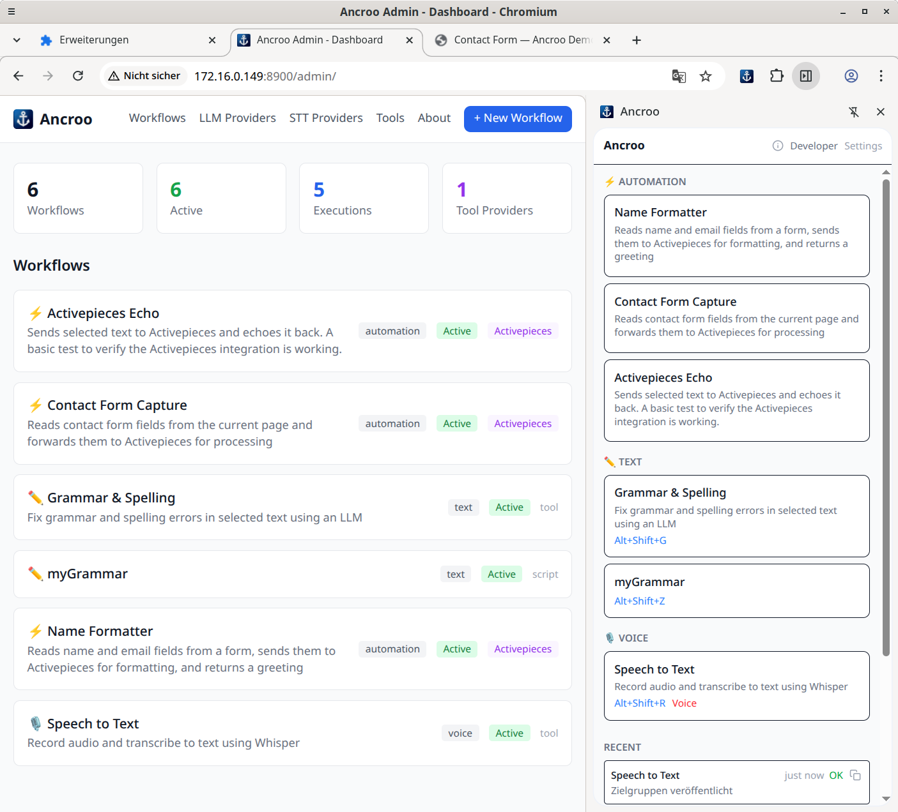
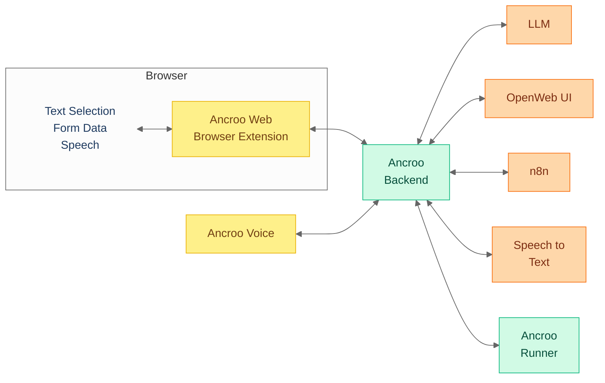

#  Ancroo

[](LICENSE)
[](https://www.gnu.org/software/bash/)
[]()

**Your AI workflows, your infrastructure, your data.** Ancroo is a self-hosted productivity ecosystem — select text in the browser, trigger an AI workflow, get results right where you work. Grammar correction, speech-to-text, form automation, and more — all powered by local LLMs and STT models. Nothing leaves your network.

> **Early stage** — Ancroo is under active development. Some components are intended for local/trusted networks only. Do not expose to the public internet without security measures.



## Why Ancroo?

- **Works where you work** — select text in any browser tab, trigger AI workflows, get results inline — no app-switching, no copy-paste
- **Any software, any website** — not tied to one editor or platform; if it runs in a browser, Ancroo can help
- **Fully self-hosted** — your data stays on your machine, no cloud dependency
- **Modular** — pick what you need: LLMs, speech-to-text, automation, wiki — enable modules with one command
- **GPU-flexible** — works with NVIDIA (CUDA), AMD (ROCm), or CPU-only
- **One installer** — 3 commands to a running stack with AI chat, workflow engine, and STT

## How It Works



**Example:** You select a paragraph with typos in your browser → press a hotkey → the extension sends the text to your server → Ollama fixes the grammar with a local LLM → the corrected text replaces your selection. Under 3 seconds, fully offline.

## Quick Install

```bash
git clone https://github.com/ancroo/ancroo.git
cd ancroo
bash install.sh
```

The installer clones all repositories, walks you through GPU and module selection, and prints a summary with all service URLs and credentials when done. See the [Stack README](https://github.com/ancroo/ancroo-stack#quick-start) for module details and non-interactive installation.

## Components

| Project                                                                    | What it does                                                                                          |
| -------------------------------------------------------------------------- | ----------------------------------------------------------------------------------------------------- |
| [**Ancroo Stack**](https://github.com/ancroo/ancroo-stack)     | Docker infrastructure — Ollama, Open WebUI, PostgreSQL, plus optional modules (STT, wiki, automation) |
| [**Ancroo Web**](https://github.com/ancroo/ancroo-web)         | Browser extension — select text, trigger workflows, get AI results inline                             |
| [**Ancroo Backend**](https://github.com/ancroo/ancroo-backend) | Workflow engine — connects extension to LLMs, STT, and n8n                                            |
| [**Ancroo Runner**](https://github.com/ancroo/ancroo-runner)   | Script runner — deterministic transformations via user-extensible plugins                              |
| [**Ancroo Voice**](https://github.com/ancroo/ancroo-voice)     | Desktop push-to-talk STT — hold a key, speak, text appears at cursor                                  |

Each component works independently, but together they form a complete self-hosted AI workspace.

## What's Included

After installation, your server runs:

| Service        | Port  | Purpose                    |
| -------------- | ----- | -------------------------- |
| Open WebUI     | 8080  | AI chat interface with RAG |
| Ollama         | 11434 | Local LLM engine           |
| Ancroo Backend | 8900  | Workflow execution API     |
| Ancroo Runner  | 8510  | Deterministic script runner |
| Homepage       | 80    | Service dashboard          |

Optional modules add speech-to-text (Speaches/Whisper-ROCm), workflow automation (n8n), a wiki (BookStack), and more.

## Contributing

Contributions are welcome! Feel free to open an [issue](https://github.com/ancroo/ancroo/issues) or submit a pull request.

## Security

See [SECURITY.md](SECURITY.md) for the full security policy, Phase 1 limitations, and roadmap.

To report a vulnerability, please use [GitHub's private vulnerability reporting](https://github.com/ancroo/ancroo/security/advisories/new) instead of opening a public issue.

## Author

**Stefan Schmidbauer** — [GitHub](https://github.com/Stefan-Schmidbauer)

## License

MIT — see [LICENSE](LICENSE). The Ancroo name is not covered by this license and remains the property of the author. Each sub-project has its own license — see the individual repositories.

---

Built with the help of AI ([Claude](https://claude.ai) by Anthropic).
