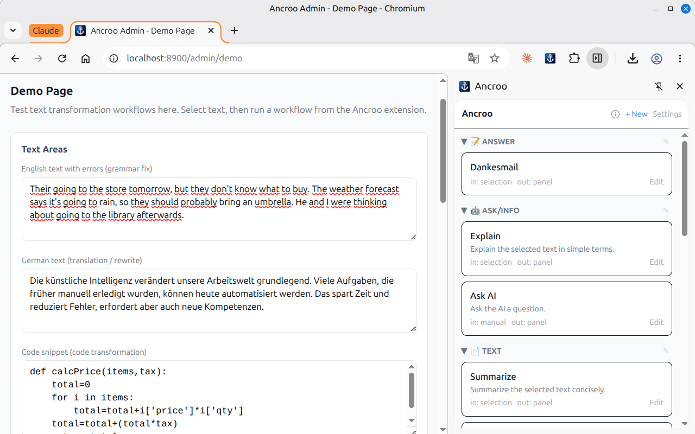
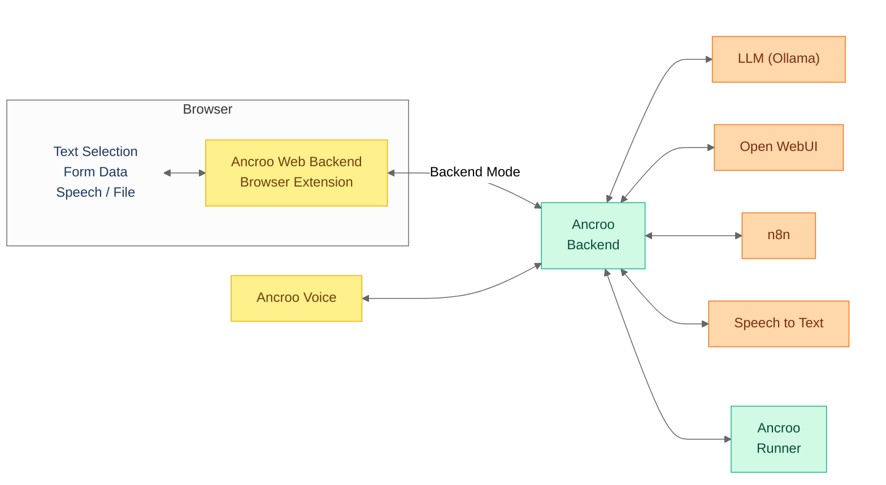
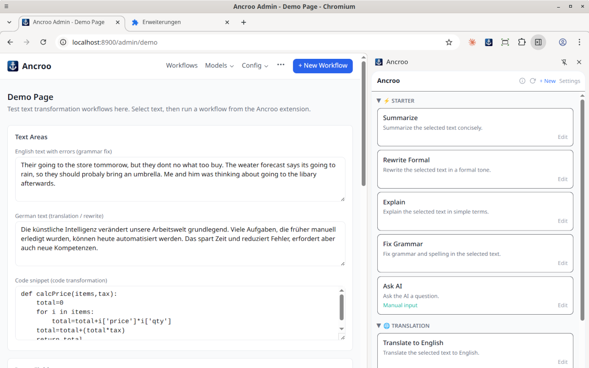

#  Ancroo

**Your AI workflows, your infrastructure, your data.**

Run AI workflows right where you work — select text, trigger a workflow, get
results in place. Grammar correction, speech-to-text, form automation, and more.
Bring your own LLM key, or self-host the whole thing.

> **This repo is the umbrella.** It gives the big-picture overview and points you
> to the right project — it holds no application code. Each piece lives in its own
> repository under the [ancroo](https://github.com/ancroo) org.

---

Ancroo is a small ecosystem of focused projects. There are **two ways in** —
pick the one that matches how much you want to run yourself.

## 🟡 Just the browser extension — no server

The fastest start. Install from the Chrome Web Store, add an LLM API key
(OpenAI / Anthropic / Gemini / Ollama), and run AI workflows on selected text.
No account, nothing leaves your network.

**Example:** Add your OpenAI or Anthropic key, select a sentence on any page, press a hotkey — the extension calls the LLM directly and replaces the text in place. No server needed.



→ **[Ancroo Web](https://github.com/ancroo/ancroo-web)** · [Chrome Web Store](https://chromewebstore.google.com/detail/ancroo/jeaaomlligaaoohplachpimjgopjmfim)

## 🟢 The self-hosted stack — full feature set

For speech-to-text, file uploads, n8n automation, tool plugins, server-managed
workflows, and (later) multi-user support. One command sets up the Docker stack:

```bash
git clone https://github.com/ancroo/ancroo-stack.git
cd ancroo-stack && bash install.sh
```

**Example:** Select a paragraph with typos in your browser → press a hotkey → the extension sends the text to your server → Ollama fixes the grammar with a local LLM → the corrected text replaces your selection. Under 3 seconds, fully offline.

→ Full install guide, service URLs, and ports: **[Ancroo Stack](https://github.com/ancroo/ancroo-stack)**


```mermaid
%%{init: {'theme': 'neutral'}}%%
graph LR
    subgraph Browser["Browser"]
        input["Text Selection<br/>Form Data<br/>Speech / File"]
        extension["Ancroo Web Backend<br/>Browser Extension"]
    end

    voice["Ancroo Voice"]
    backend["Ancroo<br/>Backend"]
    runner["Ancroo<br/>Runner"]

    subgraph Services[" "]
        direction TB
        llm["LLM (Ollama)"]
        owui["Open WebUI"]
        n8n["n8n"]
        stt["Speech to Text"]
    end

    input <--> extension
    extension <-- "Backend Mode" --> backend
    voice <--> backend
    backend <--> llm
    backend <--> owui
    backend <--> n8n
    backend <--> stt
    backend <--> runner

    style Services fill:transparent,stroke:transparent
    style input fill:transparent,stroke:transparent,color:#1e3a5f
    style extension fill:#fef08a,stroke:#eab308,color:#713f12
    style voice fill:#fef08a,stroke:#eab308,color:#713f12
    style backend fill:#d1fae5,stroke:#10b981,color:#064e3b
    style runner fill:#d1fae5,stroke:#10b981,color:#064e3b
    style llm fill:#fed7aa,stroke:#f97316,color:#7c2d12
    style owui fill:#fed7aa,stroke:#f97316,color:#7c2d12
    style n8n fill:#fed7aa,stroke:#f97316,color:#7c2d12
    style stt fill:#fed7aa,stroke:#f97316,color:#7c2d12
```

**What the backend can do:** [Ancroo Backend](https://github.com/ancroo/ancroo-backend) is a generic workflow engine — not hardcoded to specific tasks. Example workflows included out of the box:

| Workflow | What it does | Requires |
| -------- | ------------ | -------- |
| Grammar & Spelling | Fixes grammar and spelling in selected text | Ollama |
| Speech to Text | Transcribes audio via push-to-talk | Whisper STT |
| Contact Form Capture | Captures form fields, triggers n8n automation | n8n |
| Name Formatter | Extracts name fields, triggers n8n automation | n8n |

Custom workflows can be created via the admin UI or imported from a JSON file — see [ancroo-backend](https://github.com/ancroo/ancroo-backend) for the full workflow API and more examples.



## Why Ancroo?

- **Works where you work** — select text in any browser tab, trigger AI workflows, get results inline — no app-switching, no copy-paste
- **Any software, any website** — not tied to one editor or platform; if it runs in a browser, Ancroo can help
- **Your data stays local** — nothing leaves your machine or network
- **All-in-one** — LLMs, speech-to-text, automation, wiki, dashboard — everything runs out of the box
- **GPU-flexible** — works with NVIDIA (CUDA), AMD (ROCm), or CPU-only
- **One installer** — 3 commands to a running stack with AI chat, workflow engine, and STT

> **Phase 0 (Beta)** — Core functionality is in place and usable on trusted local
> networks, but the stack runs without encryption or authentication and is still
> under active development. Intended for local/trusted networks only. See the
> [Roadmap](ROADMAP.md) for the security path forward.

---

## The projects

| Project | What it does |
| ------- | ------------ |
| [**Ancroo Web Backend**](https://github.com/ancroo/ancroo-web-backend) | Browser extension, **backend** mode — connects to the self-hosted stack for STT, file uploads, n8n, and multi-user. Also supports direct LLM calls. Not on the Chrome Store. |
| [**Ancroo Stack**](https://github.com/ancroo/ancroo-stack) | Self-hosted Docker infrastructure — Ollama, Open WebUI, PostgreSQL, n8n, BookStack, STT. Owns the installer, service URLs, and ports. |
| [**Ancroo Backend**](https://github.com/ancroo/ancroo-backend) | Workflow engine — connects the extension to LLMs, STT, and n8n. Ships the example workflow definitions. |
| [**Ancroo Runner**](https://github.com/ancroo/ancroo-runner) | Deterministic script runner via user-extensible plugins. |
| [**Ancroo Voice**](https://github.com/ancroo/ancroo-voice) | Desktop push-to-talk STT — hold a key, speak, text appears at cursor. |

## Where to find what

| Looking for… | Go to |
| ------------ | ----- |
| Install the stack, service URLs & ports | [ancroo-stack](https://github.com/ancroo/ancroo-stack) |
| Example workflow definitions & the workflow API | [ancroo-backend](https://github.com/ancroo/ancroo-backend) |
| Browser extension (no server) | [ancroo-web](https://github.com/ancroo/ancroo-web) |
| Security maturity plan | [ROADMAP.md](ROADMAP.md) |
| Third-party software & licenses | [ancroo-stack/NOTICE](https://github.com/ancroo/ancroo-stack/blob/main/NOTICE) |

---

## Contributing

Contributions are welcome — open an [issue](https://github.com/ancroo/ancroo/issues) or a pull request in the relevant repository.

## Security & Roadmap

See the [Roadmap](ROADMAP.md) for the phased security path (encryption → API protection → SSO/multi-user).

See [SECURITY.md](SECURITY.md) for the vulnerability reporting policy. To report a vulnerability, please use [GitHub's private vulnerability reporting](https://github.com/ancroo/ancroo/security/advisories/new) instead of opening a public issue.

## Author

**Stefan Schmidbauer** — [GitHub](https://github.com/Stefan-Schmidbauer) · [stefan@ancroo.com](mailto:stefan@ancroo.com)

## License

MIT — see [LICENSE](LICENSE). The Ancroo name is not covered by this license and remains the property of the author. Each sub-project has its own license — see the individual repositories.

---

Built with the help of AI ([Claude](https://claude.ai) by Anthropic).
