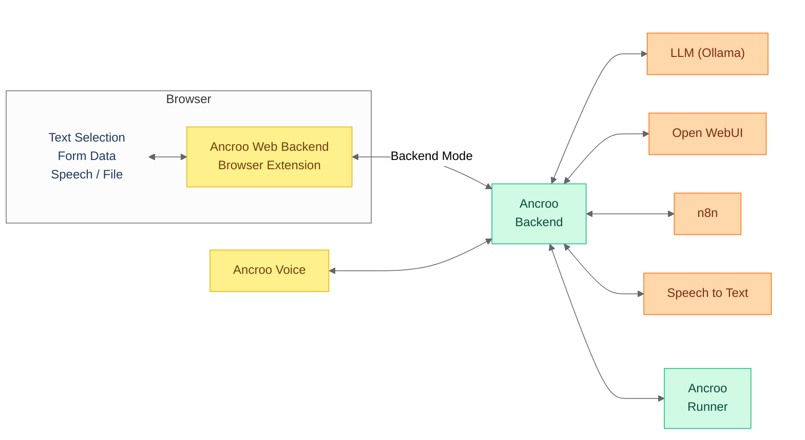

#  Ancroo

[](LICENSE)
[]()

**Your AI workflows, your infrastructure, your data.** Ancroo lets you run AI workflows directly in your browser — select text, trigger a workflow, get results right where you work. Grammar correction, speech-to-text, form automation, and more.

---

## Ancroo Web — browser-only, no server

Want just the browser extension without a server? Use **[Ancroo Web](https://github.com/ancroo/ancroo-web)** — install from the [Chrome Web Store](https://chromewebstore.google.com/detail/ancroo/jeaaomlligaaoohplachpimjgopjmfim), add an LLM API key (OpenAI / Anthropic / Gemini / Ollama), and run AI workflows on selected text. No account, nothing leaves your network.

---

## Ancroo Stack — Self-Hosted Backend

For the full feature set — speech-to-text, n8n automation, tool plugins, file uploads, multi-user support, and server-managed workflows — run the self-hosted stack.


```mermaid
%%{init: {'theme': 'neutral'}}%%
graph LR
    subgraph Browser["Browser"]
        input["Text Selection<br/>Form Data<br/>Speech / File"]
        extension["Ancroo Web Backend<br/>Browser Extension"]
    end

    voice["Ancroo Voice"]
    backend["Ancroo<br/>Backend"]
    runner["Ancroo<br/>Runner"]

    subgraph Services[" "]
        direction TB
        llm["LLM (Ollama)"]
        owui["Open WebUI"]
        n8n["n8n"]
        stt["Speech to Text"]
    end

    input <--> extension
    extension <-- "Backend Mode" --> backend
    voice <--> backend
    backend <--> llm
    backend <--> owui
    backend <--> n8n
    backend <--> stt
    backend <--> runner

    style Services fill:transparent,stroke:transparent
    style input fill:transparent,stroke:transparent,color:#1e3a5f
    style extension fill:#fef08a,stroke:#eab308,color:#713f12
    style voice fill:#fef08a,stroke:#eab308,color:#713f12
    style backend fill:#d1fae5,stroke:#10b981,color:#064e3b
    style runner fill:#d1fae5,stroke:#10b981,color:#064e3b
    style llm fill:#fed7aa,stroke:#f97316,color:#7c2d12
    style owui fill:#fed7aa,stroke:#f97316,color:#7c2d12
    style n8n fill:#fed7aa,stroke:#f97316,color:#7c2d12
    style stt fill:#fed7aa,stroke:#f97316,color:#7c2d12
```

### Quick Install

```bash
git clone https://github.com/ancroo/ancroo-stack.git
cd ancroo-stack
bash install.sh
```

The installer walks you through GPU and STT selection, optionally clones companion projects, and prints a summary with all service URLs and credentials when done.

> **Phase 0 (Beta)** — Core functionality is in place and usable on trusted local networks, but the stack runs without encryption or authentication and is still under active development. Intended for local/trusted networks only. See the [Roadmap](ROADMAP.md) for the security path forward.

### Components

| Project | What it does |
| ------- | ------------ |
| [**Ancroo Web Backend**](https://github.com/ancroo/ancroo-web-backend) | Browser extension (backend mode) — connects to the self-hosted stack for STT, file uploads, n8n, and multi-user support. Also supports direct LLM calls. Not on Chrome Store — install manually. |
| [**Ancroo Stack**](https://github.com/ancroo/ancroo-stack) | Docker infrastructure — Ollama, Open WebUI, PostgreSQL, n8n, BookStack, STT, and more |
| [**Ancroo Backend**](https://github.com/ancroo/ancroo-backend) | Workflow engine — connects extension to LLMs, STT, and n8n |
| [**Ancroo Runner**](https://github.com/ancroo/ancroo-runner) | Script runner — deterministic transformations via user-extensible plugins |
| [**Ancroo Voice**](https://github.com/ancroo/ancroo-voice) | Desktop push-to-talk STT — hold a key, speak, text appears at cursor |

### Services

After installation, your server runs:

| Service          | Port       | Purpose                    |
| ---------------- | ---------- | -------------------------- |
| Open WebUI       | 8080       | AI chat interface with RAG |
| Ollama           | 11434      | Local LLM engine           |
| Ancroo Backend   | 8900       | Workflow execution API     |
| Ancroo Runner    | 8510       | Deterministic script runner |
| n8n              | 5678       | Workflow automation        |
| BookStack        | 8875       | Documentation wiki         |
| Speaches/Whisper | 8100/8002  | Speech-to-text             |
| Homepage         | 80         | Service dashboard          |
| Adminer          | 8081       | Database admin UI          |

---

## Contributing

Contributions are welcome! Feel free to open an [issue](https://github.com/ancroo/ancroo/issues) or submit a pull request.

## Security & Roadmap

See the [Roadmap](ROADMAP.md) for the phased security path (encryption → API protection → SSO/multi-user).

See [SECURITY.md](SECURITY.md) for the vulnerability reporting policy. To report a vulnerability, please use [GitHub's private vulnerability reporting](https://github.com/ancroo/ancroo/security/advisories/new) instead of opening a public issue.

## Author

**Stefan Schmidbauer** — [GitHub](https://github.com/Stefan-Schmidbauer) · [stefan@ancroo.com](mailto:stefan@ancroo.com)

## Acknowledgments

Ancroo builds on these open-source projects:

| Project | Purpose | License |
|---------|---------|---------|
| [Ollama](https://ollama.com/) | Local LLM inference | MIT |
| [Open WebUI](https://docs.openwebui.com/) | AI chat interface with RAG | [Open WebUI License](https://docs.openwebui.com/license/) |
| [OpenAI Whisper](https://github.com/openai/whisper) | Speech recognition models | MIT |
| [Speaches](https://github.com/speaches-ai/speaches) | Whisper API server (CUDA) | MIT |
| [n8n](https://n8n.io/) | Workflow automation | [Sustainable Use License](https://github.com/n8n-io/n8n/blob/master/LICENSE.md) |
| [PostgreSQL](https://www.postgresql.org/) | Database | PostgreSQL License |
| [Homepage](https://gethomepage.dev/) | Service dashboard | GPL-3.0 |

For the complete list of third-party software and licenses, see the [Ancroo Stack NOTICE file](https://github.com/ancroo/ancroo-stack/blob/main/NOTICE).

## License

MIT — see [LICENSE](LICENSE). The Ancroo name is not covered by this license and remains the property of the author. Each sub-project has its own license — see the individual repositories.

---

Built with the help of AI ([Claude](https://claude.ai) by Anthropic).
